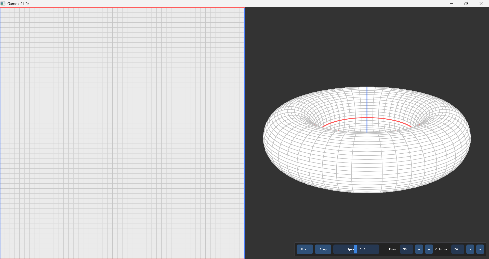

# Game of Life

A modular and modern implementation of **Conway’s Game of Life** written in **C++17** using **OpenGL 3.3**, **GLFW**, **GLAD**, **GLM**, and **ImGui**.

The project renders the simulation in real time through synchronized **2D grid** and **3D torus** views, allowing users to explore both the **cellular automaton dynamics** and its **topological interpretation**.

Beyond its visual appeal, the project also serves as:

* A minimal **computational model of population growth and decay**, based on local interaction rules.
* A **didactic visualization of toroidal geometry**, showing how a 2D grid can be seamlessly wrapped into a 3D surface.
* An example of **modern C++ and OpenGL architecture**, with modular systems for logic, rendering, and UI integration.
* A compact and extensible base for experimentation with **GPU simulations**, **shader-based visualizations**, or **scientific cellular automata** (see [CONTRIBUTE.md](CONTRIBUTE.md) for more info).

The codebase emphasizes clarity, maintainability, and clean design—ideal for studying or extending.

---

## Features

* Real-time simulation with adjustable fixed-step timing
* Dual visualization modes:

  * 2D grid with interactive cell editing
  * 3D torus view with an orbit camera
* Fully modular architecture:

  * `core/` – simulation logic
  * `render/` – 2D and 3D rendering
  * `ui/` – ImGui toolbar
  * `app/` – lifecycle and systems integration
* Modern OpenGL pipeline (VAO, VBO, EBO, GLSL shaders)
* User interface controls for:

  * Play / Pause / Step / Clear
  * Grid size (rows and columns)
  * Simulation speed

---

## Requirements

* Windows 10 / 11
* CMake ≥ 3.23
* Visual Studio 2022 (MSVC) or compatible compiler
* Ninja (build system used by presets)
* vcpkg (dependency manager)

> The project depends on: **glfw3**, **glad**, **glm**, and **imgui**.

---

## User Interface

The following image corresponds to the app layout:



The window is divided into two synchronized viewports and a compact toolbar:

* **Left — 2D grid**: interactive editor (toggle cells with left click), hover highlight, and grid overlay.
* **Right — 3D torus**: orbit camera (left click + drag) and zoom (scroll), showing the same state wrapped on a toroidal surface.
* **Toolbar (bottom-right)**: Play/Pause, Step, Clear, **Speed** slider, and **Rows / Columns** (applied on *Enter* or when the field loses focus).

---

## Controls

| Context                  | Action                      | Description                  |
| ------------------------ | --------------------------- | ---------------------------- |
| **2D View** (left pane)  | Left Click                  | Toggle cell                  |
| **3D View** (right pane) | Left Click + Drag           | Orbit camera (yaw/pitch)     |
|                          | Scroll                      | Zoom in/out                  |
| **UI (Toolbar)**         | Play / Pause / Step / Clear | Simulation control           |
|                          | Rows / Columns              | Apply on Enter or focus loss |
|                          | Speed                       | Adjust steps per second      |

---

## Build

The project supports both **command-line builds** and **Visual Studio integration**. All presets use **vcpkg manifests** and a **Ninja generator**, ensuring reproducible, IDE-independent builds.

> ⚙️ The paths and presets are designed for Visual Studio 2022 Community, but they can be easily adapted for Professional or Enterprise editions by changing the Visual Studio folder name in the PowerShell examples.

### A) From terminal (no IDE)

Open a **Developer PowerShell for VS 2022** and run:

```powershell
cmake --preset x64-debug-vcpkg
cmake --build --preset x64-debug-vcpkg
.\out\build\x64-debug-vcpkg\GameOfLife.exe
```

To build in *Release* mode:

```powershell
cmake --preset x64-release-vcpkg
cmake --build --preset x64-release-vcpkg
```

If using a regular PowerShell (not the Developer shell), you can manually initialize MSVC:

```powershell
$vsdev = "$env:ProgramFiles\Microsoft Visual Studio\2022\Community\Common7\Tools\VsDevCmd.bat"
$cmake = "$env:ProgramFiles\Microsoft Visual Studio\2022\Community\IDE\CommonExtensions\Microsoft\CMake\CMake\bin\cmake.exe"

cmd /c """$vsdev"" -arch=x64 && ""$cmake"" --preset x64-debug-vcpkg && ""$cmake"" --build --preset x64-debug-vcpkg"

.\out\build\x64-debug-vcpkg\GameOfLife.exe
```

---

### B) With Visual Studio

1. **Open Folder** → open the repository root.
2. Run **CMake > Delete Cache and Reconfigure** (first time only).
3. In the bottom toolbar, choose:

   * **Configure Preset:** `x64 Debug (vcpkg manifest)`
   * **Build Preset:** `Build x64 Debug (vcpkg)` or `Build x64 Release (vcpkg)`
4. Open **View > CMake Targets**, right-click
   **GameOfLife (executable)** → **Set as Startup Item**.
5. Press **F5** (debug) or **Ctrl + F5** (run without debugging).

---

### Clean build (optional)

If you want to start from a clean configuration:

```powershell
Remove-Item -Recurse -Force .\out\build\* -ErrorAction SilentlyContinue
Remove-Item -Recurse -Force .\out\install\* -ErrorAction SilentlyContinue
```

---

## Linux / macOS

The repository is currently optimized for **Windows + MSVC**, but it can be easily ported to other platforms:

* Add platform-specific presets (for GCC/Clang) to `CMakePresets.json`.
* Bootstrap vcpkg with `./external/vcpkg/bootstrap-vcpkg.sh`.
* Make sure OpenGL headers and the required SDKs are installed.

All vcpkg paths are **relative**, and no global environment variables are required.

For details on contributing Linux or macOS build configurations, see **[CONTRIBUTE.md](CONTRIBUTE.md)**.

---
