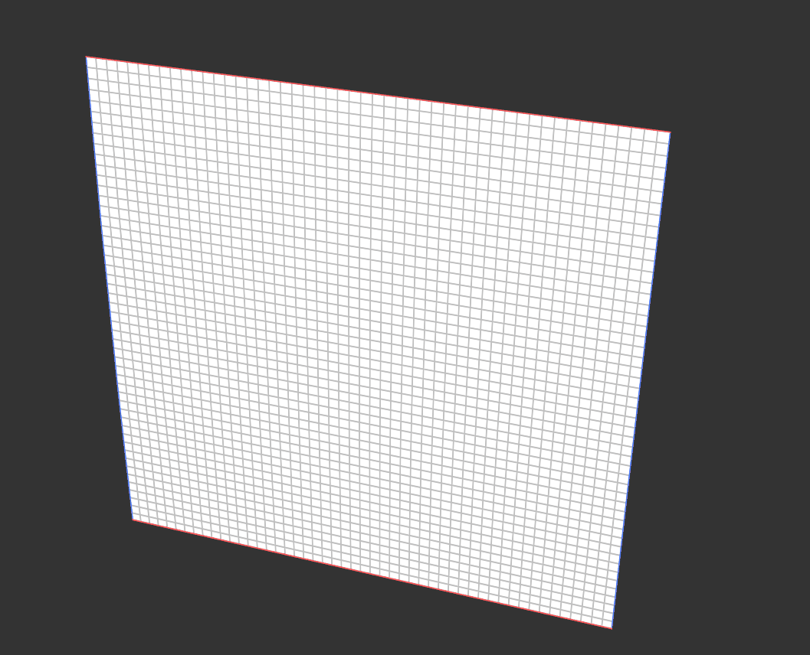
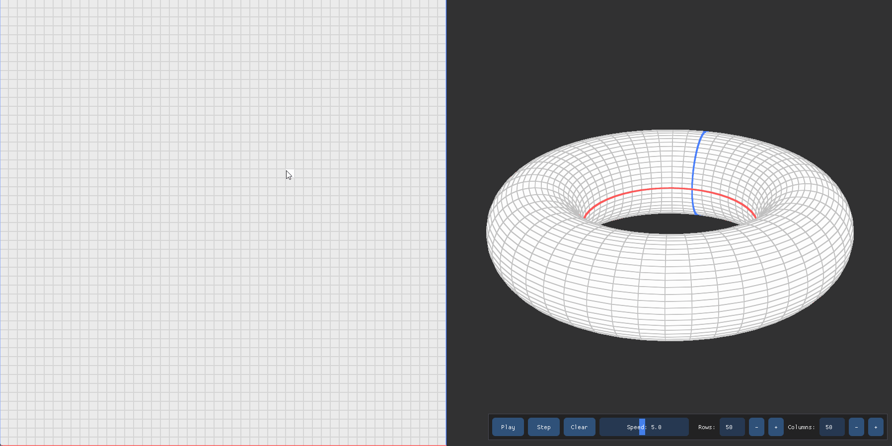

# 3D Game of Life Engine

A high-performance, hardware-accelerated simulation of **Conway's Game of Life** rendered on a continuous toroidal topology. This project leverages **Modern C++17**, **OpenGL 3.3+**, and **ImGui** to provide a robust visualization engine with real-time interaction capabilities.

The simulation operates on a discrete grid mapped onto a topologically finite, yet unbounded surface ($T^2$). This resolves boundary conditions through topological identification rather than artificial clipping, allowing patterns to propagate indefinitely across the manifold.


[](https://github.com/iago-fernandez/3d-game-of-life/releases)
[](CMakeLists.txt)
[](https://www.opengl.org/)
[](CMakeLists.txt)
[](LICENSE)

## Core Engineering

Designed with a focus on **architectural cleanliness**, **memory safety**, and **graphics pipeline efficiency**:

* **Architecture:** Strict separation of concerns between the **Simulation Core** (CPU cellular automata logic), **Render Engine** (GPU state management), and **UI Layer**.
* **Resource Management:** Full adherence to **RAII** (Resource Acquisition Is Initialization) principles using smart pointers (`std::unique_ptr`) to ensure deterministic destruction of OpenGL contexts and GLFW windows without memory leaks.
* **Pipeline Optimization:** Utilization of `GL_R8` textures for state representation, minimizing CPU-GPU bus bandwidth usage during state uploads (1 byte per cell).
* **Dependency Management:** Reproducible, hermetic builds via **vcpkg manifest mode**, ensuring an identical build environment across Windows and Linux platforms.

## Mathematical Definition

### The Cellular Automaton (`Core`)
The universe is defined as a discrete grid $G \subset \mathbb{Z}^2$. For a cell $c$ at state $S_t \in \{0, 1\}$ at time $t$, and $N(c)$ being the set of its 8 Moore neighbors, the evolution function $\delta: G \to \{0,1\}$ defining the state at $t+1$ is:

$$
S_{t+1}(c) = 
\begin{cases} 
1 & \text{if } S_t(c)=1 \land \sum_{n \in N(c)} S_t(n) \in \{2, 3\} \\
1 & \text{if } S_t(c)=0 \land \sum_{n \in N(c)} S_t(n) = 3 \\
0 & \text{otherwise}
\end{cases}
$$

### Topology & The Fundamental Polygon (`Model`)
To achieve an unbounded simulation domain within finite memory constraints, the grid is modeled as a **Flat Torus** ($T^2$). Mathematically, the domain is constructed as the quotient space $\mathbb{R}^2 / \Lambda$, where $\Lambda$ is the integer lattice generated by the grid dimensions $(W, H)$.

This construction is visualized via the **Fundamental Polygon**, a planar rectangle where opposite edges are identified (glued) together preserving orientation:

$$(x, y) \sim (x + W, y) \quad \text{and} \quad (x, y) \sim (x, y + H)$$

### 3D Embedding
To visualize this abstract topology in Euclidean space $\mathbb{R}^3$, the normalized grid coordinates $(u, v) \in [0, 1]^2$ are mapped to a toroidal surface using the parametric equations:

$$
\begin{aligned}
x(u, v) &= (R + r \cos(2\pi v)) \cos(2\pi u) \\
y(u, v) &= (R + r \cos(2\pi v)) \sin(2\pi u) \\
z(u, v) &= r \sin(2\pi v)
\end{aligned}
$$

The engine includes a procedural tool to visualize the morphing from the flat 2D grid to the 3D manifold (`src/tools/topologyAnimation.cpp`), which generates the following animation:



## Interactive Simulation

The application integrates an ImGui toolbar allowing real-time control over the simulation loop (`fixed-timestep` updates), dynamic grid parameter modification, and direct interaction with the cellular state.

**Key Features:**

* **Immersive Navigation (Backface Culling):** The engine leverages OpenGL's pipeline to allow interior inspection of the torus. Since the geometry normals point outwards, zooming "inside" the mesh causes the backward-facing polygons (the outer skin) to be culled by the GPU (`glCullFace`). This grants an unobstructed view of the internal topology without needing transparency shaders.
* **Dynamic Resizing:** Hot-reallocation of simulation buffers and immediate reconstruction of the 3D mesh geometry at runtime.
* **Orbit Camera:** Arcball-style camera navigation providing intuitive zoom and rotation around the manifold.



## Project Structure

The repository maintains a clear distinction between public interfaces (`include/`) and private implementations (`src/`):

```text
3d-game-of-life/
├── assets/                 # Documentation media and visual assets
├── include/                # Public Interface (Headers)
│   ├── app/
│   │   ├── app.h           # Main application lifecycle
│   │   └── input.h         # Input state structures
│   ├── core/
│   │   ├── camera.h        # 3D orbit camera mathematics
│   │   ├── gameLogic.h     # Pure CPU-based Game of Life logic
│   │   └── simulation.h    # High-level wrapper balancing CPU logic and GPU state
│   ├── model/
│   │   └── torus.h         # Procedural generation of topological meshes
│   ├── render/
│   │   ├── renderer2d.h    # Fullscreen quad renderer
│   │   └── renderer3d.h    # 3D surface renderer
│   ├── ui/
│   │   └── toolbar.h       # ImGui layout definitions
│   └── utils/
│   │   └── shaderUtils.h   # GLSL compilation helpers
├── src/                    # Implementation (Source)
│   ├── app/                # Application & Input implementation
│   ├── core/               # Simulation logic implementation
│   ├── model/              # Vertex generation algorithms
│   ├── render/             # OpenGL calls and uniform management
│   ├── tools/
│   │   └── topologyAnimation.cpp # Tool for generating topology GIFs
│   ├── ui/                 # Toolbar logic
│   ├── utils/              # File I/O and Error checking
│   └── main.cpp            # Entry point
├── shaders/                # GLSL Vertex & Fragment shaders
├── vcpkg.json              # C++ Dependency manifest
├── CMakeLists.txt          # Main build configuration
└── CMakePresets.json       # Cross-platform build configurations

```

## Installation & Build

This project relies on **CMake** as the build system and **vcpkg** for dependency management. It is designed to fetch and compile all necessary libraries (GLFW, Glad, ImGui, GLM) automatically.

### Prerequisites

* **C++ Compiler** with C++17 support (e.g., MSVC v142+, GCC 9+, Clang 10+).
* **CMake 3.20** or newer.
* **Git**.

### Build Instructions

#### Option A: Command Line (Preferred)

1. **Clone the repository:**
```bash
git clone https://github.com/iago-fernandez/3d-game-of-life.git
cd 3d-game-of-life
```

2. **Configure:**
This step initializes vcpkg and downloads dependencies. This may take several minutes on the first run.
```bash
cmake --preset x64-release-vcpkg
```

3. **Build:**
```bash
cmake --build --preset x64-release-vcpkg
```

4. **Run:**
The artifacts are placed in the build output directory:
```bash
./out/build/x64-release-vcpkg/GameOfLife
```

#### Option B: Visual Studio 2022

1. Open Visual Studio and select **"Open a local folder"**.
2. Navigate to the cloned repository folder.
3. Visual Studio will automatically detect `CMakeLists.txt` and configure the project using the defined presets.
4. Select **`x64-release-vcpkg`** from the configuration dropdown.
5. Build and run (F5).

## Controls

| Context | Input | Action |
| --- | --- | --- |
| **3D View** | **LMB + Drag** | Orbit Camera (Rotate) |
| **3D View** | **Scroll** | Zoom In / Out (Enter interior view) |
| **Grid / UI** | **LMB Click** | Toggle Cell State |
| **Toolbar** | **UI Buttons** | Play, Pause, Step, Clear, Resize |

## Contributing

Contributions regarding performance optimizations (e.g., SIMD implementations) or new mathematical mappings are welcome. Please review the [CONTRIBUTING.md](CONTRIBUTING.md) file for engineering standards before submitting a pull request.

## License

This project is licensed under the MIT License. See the [LICENSE](LICENSE) file for details.
